## 1. 规则表达式调研

#### 1.1 工具类方案

hutool封装了统一的工具类ExpressionUtil，内部采用单例、工厂类、Facade门面设计模式，提供不同实现引擎，每个引擎引用外部jar包：

| jar                | 效率             |
|--------------------|----------------|
| googlecode.aviator | 初始化时间较久，执行效率最高 |
| commons-jexl3      | 初始化次之，执行效率次之   |
| mvel2              | 初始化最快，执行效率最慢   |

**总结：使用aviator单例预加载**

#### 1.2 根据规则配置动态生成java代码

<https://www.cnblogs.com/barrywxx/p/13233373.html>

1. JDK
2. Groovy：  groovy脚本加载到db，在db中修改同步至本地缓存

```java
GroovyClassLoader groovyClassLoader = new GroovyClassLoader();
Class<?> clazz = groovyClassLoader.parseClass(javaString);
Object obj = clazz.newInstance();
Method method = clazz.getDeclaredMethod("sayHello");
method.invoke(obj);
Object val = method.getDefaultValue();
```

## 2. 基于GuavaCache构建本地缓存

1. 注解配置mode、time、size
2. concurrentHashMap缓存单例

## 3. 灰度发布方案调研

**基于spring cloud gateway:**

原理：filter->servlet->interceptor->controller
扩展：网关、鉴权、限流、熔断、登录、操作日志

#### 3.1 网关服务

- 组件有SpringCloudGateway、SpringCloudZuul
- 由网关收口外部请求，统一服务路由和负载均衡

**方案:**

**过滤器filter(pre、routing、post、error):**

1. 拦截请求
2. 转发给自定义负载均衡器
3. scheme置为null，不会进行额外处理，直接进入下一个filer，不会再被其他filter篡改请求

先执行自定义的``GrayLoadBalancerClientFilter``，后执行**Gateway**内置的``ReactiveLoadBalancerClientFilter``

**负载均衡器**

自定义负载均衡器，根据请求体内容，指向灰度服务/生产服务
实现父类``ReactorServiceInstanceLoadBalancer``

    内置负载均衡器，需依赖springcloudloadblancer，ribbion被移除

**缺点：** 服务信息及负载配置在gateway本地

#### 3.2 结合服务注册中心

- 组件有nacos、SpringCloudEureka、ZooKeeper、Etcd
- 服务信息和负载配置动态配置在注册中心
  
**方案:**

| nacos注册        | service code | service version |
|----------------|--------------|-----------------|
| service A      | code A       | 1               |
| service A beta | code A       | 2               |
| gateway        | code B       | -               |

#### 3.3 服务内部调用的灰度实现方案

- 组件: SpringCloudFeign、SpringCloudRibbon
  
**方案:**

  1. 微服务启动时将自己注册到服务注册中心
  2. feigh根据注解生成动态代理，调用方法时底层生成 /api/xxx的http协议格式 (此出带上灰度标签，透传至下一服务)
  3. 最终调用ribbon从本地nacos注册表缓存中，根据服务名获取服务ip，负载均衡算法选出一台ip，拼接生成url：127.0.0.1：8080/api/xxx,最后基于httpclient调用请求

#### 3.4 搭建灰度管理后台

- 原存于注册中心的灰度策略剥离开，注册中心只保留全局灰度开关
- 网关服务拉取配置信息

**方案:**

1. 配置灰度规则：更丰富的灰度策略：国家、省份；更新全局开关至注册中心
2. 设置灰度服务器：调用nacos接口获取服务器ip，指定灰度机器
3. 同步策略：变更时通知网关服务更新

#### 3.5 总体流程

1. **在管理后台设置灰度规则**-*规则数据落地至db*;
    **指定灰度服务器**-*配置数据同步至nacos*
2. **gateway服务开发自定义前置过滤器**：*过滤所有进来的请求，判断是否匹配灰度规则*
   1. 初始化规则-从nacos获取全局开关
   &emsp;&emsp;- 开：调用nacos接口获取全量有效灰度规则
   &emsp;&emsp;- 关：跳过当前过滤器，执行下一过滤器
   2. 获取请求头
   3. 过滤灰度规则：删除空的、无效的过滤规则
   4. 匹配灰度规则：匹配请求头和全量灰度规则-匹配上：
   &emsp;&emsp;-> 把灰度标签加到网关请求头``requestContext`` [^1]
   &emsp;&emsp;-> 把灰度标签加到ribbon过滤器上下文

3. **ribbon设置**：*是客户端负载均衡, 通过对ribbon上下文中的灰度标签和微服务列表中灰度标签的比较, 来选择一台灰度服务器, 作为目标跳转服务器*
    ``MetadataBalancerRule extends AbstractLoadBalancerRule``-实现``choose(Object key)``方法：
   1. 根据服务名获取可用服务器列表：``reachableInstanceList``
   2. 获取上下文中写入ribbon的灰度规则
   3. 循环遍历服务列表 判断服务元数据是否满足灰度规则，满足：加入grayInstanceList
   4. 判断``grayInstanceList``是否为空-不为空：从中选一台服务器：可根据负载均衡策略选（系统自带：``roundRobbinRule``、``randomRule``,可根据nacos配置的权重，自定义带权重的lb）-为空：从``reachableInstanceList``中选取一台
   5. 返回server

4. **自定义Feign拦截器，实现参数（灰度标签）的透传:** *feign的实质是拦截器, feign将拦截所有的请求跳转, 主要作用是用来做header参数透传, 保证服务间的调用也可以正确选择灰度服务器*
    ``FeginRequestInterceptor implements RequestInterceptor``-实现``apply()``方法
   1. 获取gray_header灰度请求头
   2. 将灰度标签透传到下一个请求的header
   3. 将灰度标签放入ribbon请求上下文

[^1]:requestContext是整个网关请求共享的上下文，后面过滤器中也有效
demo

## 4. AWS上的网关与负载均衡

### 4.1 Route 53 (DNS): 服务发现和服务路由

**指定公网路由**

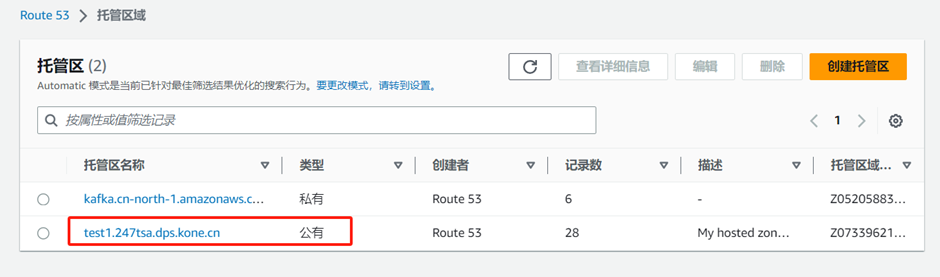

**公网域名指向CloudFront服务器**

    pmc.test1.247tsa.dps.kone.cn 路由到 d2za3m832g9o2e.cloudfront.cn CloudFront 服务器
  
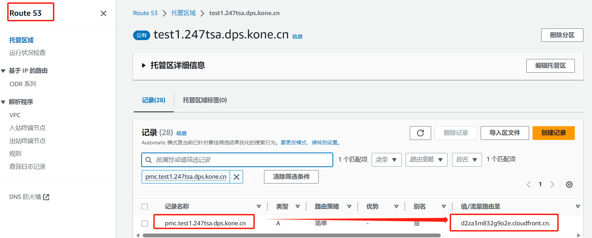

  

### 4.2 CloudFont (CDN)

**GSB：对外DNS解析**
**SLB: 对内，重定向，Nginx反向代理、内网穿透，负载均衡**


    根据路径模式配置源：
    路径：DNS名称（到ECS的ELB）
    /api/*  ： pmc-e-Servi-6OFIRV94WNNU-660412877.cn-north-1.elb.amazonaws.com.cn
    
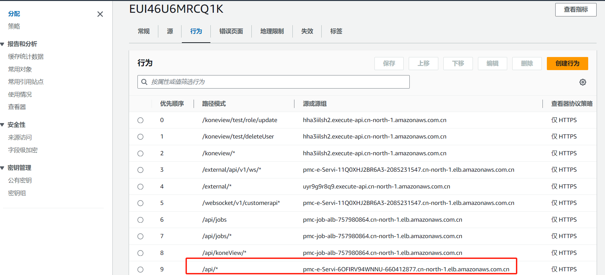

 1. *用户点击URL-> 本地DNS解析-> 把域名解析权通过CNAME指向CDN专用DNS服务器*
 2. *CDN的DNS服务器把GSB的设备IP发送给用户*
 3. *用户向GSB设备发起URL请求*
 4. *GSB根据用户IP地址及URL，转发给一台区域负载均衡设备*
 5. *区域负载均衡根据用户ip及url给用户选择就近且有负载能力的CDN缓存服务器IP*
 6. *GSB返回给用户服务器IP*
 7. *用户向缓存服务器发送请求，缓存服务器没内容，向上级服务器请求直到源服务器*
   
   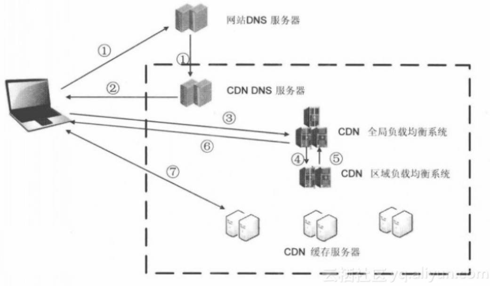

### 4.3 EC2的负载均衡器（ALB）与目标组

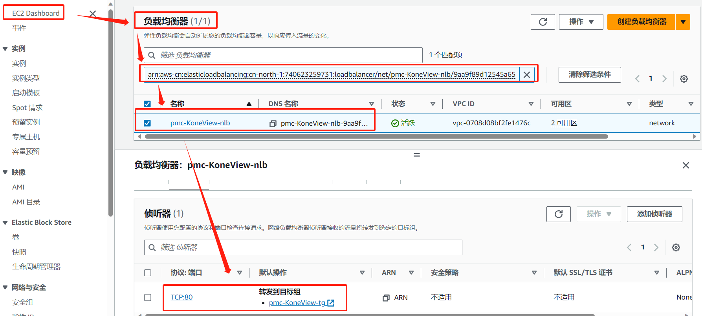

**负载均衡器**

弹性负载均衡的工作原理

1. 客户向您的应用程序提出请求。
2. 负载均衡器中的**侦听器接收与您配置的协议和端口匹配**的请求。
3. 接收侦听器根据您指定的规则评估传入的请求，如果适用，请求将路由到相应的目标组。您可以使用 HTTPS 侦听器将 TLS 加密和解密的工作卸载到负载均衡器。
4. 一个或多个目标组中健康的目标将根据负载均衡算法和您在侦听器中指定的路由规则接收流量。

        转发到目标组pmc-backend-service-tg
        已注册目标172.31.83.247
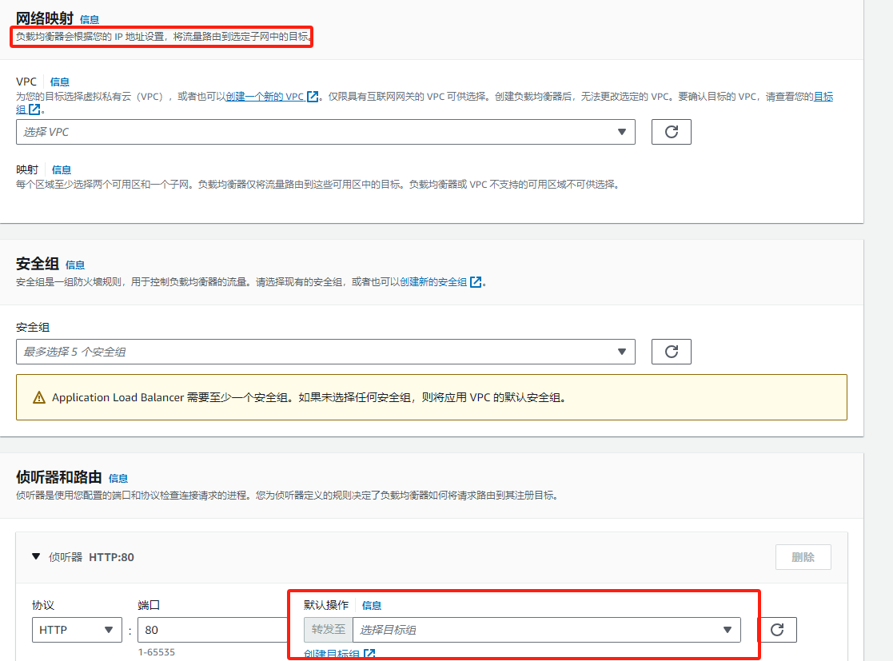

**创建目标组注册目标**
通过目标组与VPC绑定，把外部请求打入到私有资源中
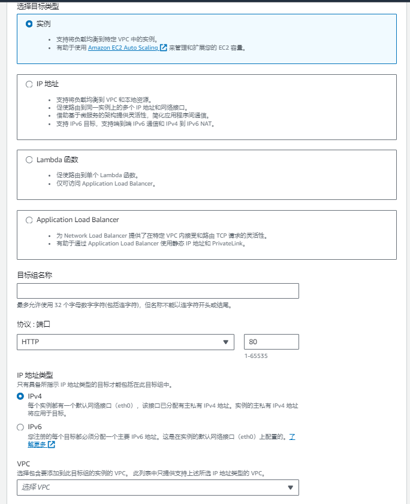
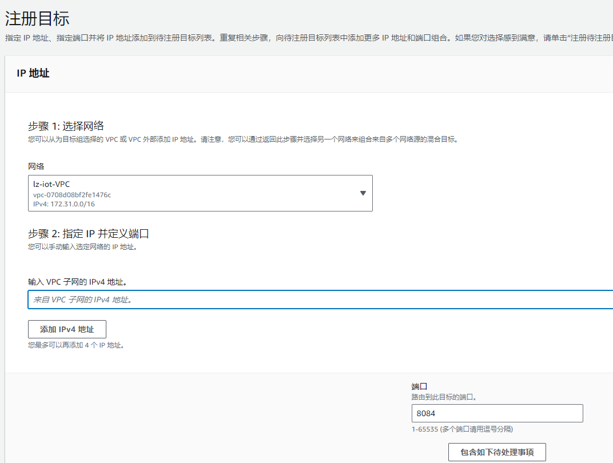


### 4.4 私有资源（VPC）

VPC 是由 AWS 对象（如 Amazon EC2 实例）填充的 AWS 云的隔离部分。
配置硬件网关地址

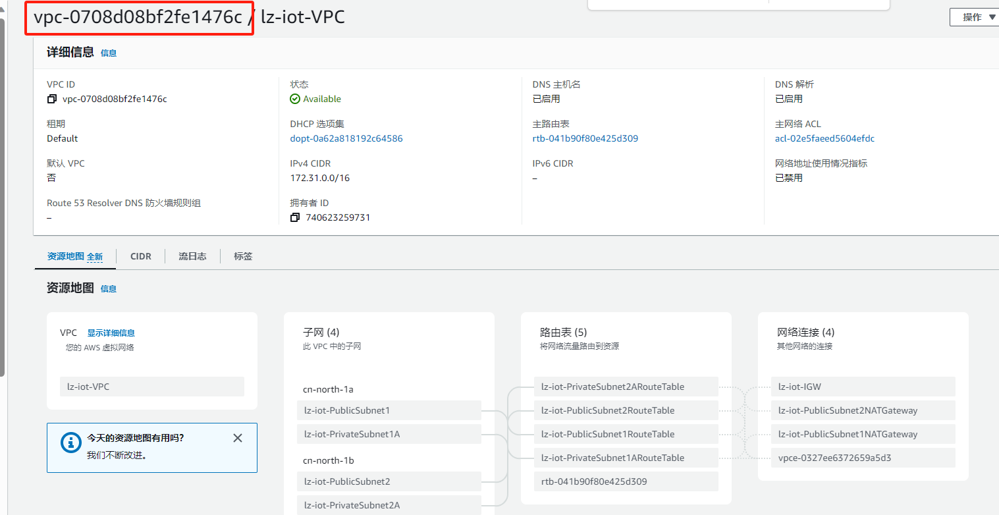

### 4.5 ECS

**定义任务**:（pmc-backend-service）

- 指定系统配置: 操作系统、CPU、内存
- 创建容器：创建容器名称、URI、指定端口号

        映像URI:655527736351.dkr.ecr.cn-north-1.amazonaws.com.cn/kone/pmc/backend:web-test-76b33a04

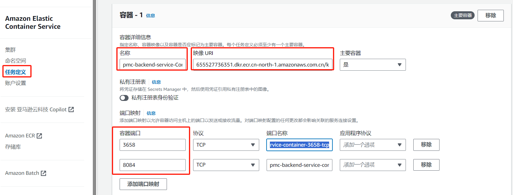

ECS创建集群，集群内**创建服务**：

- 选择部署配置：可由定义的任务决定
- 选择负载均衡器：绑定ALB，目标组
  
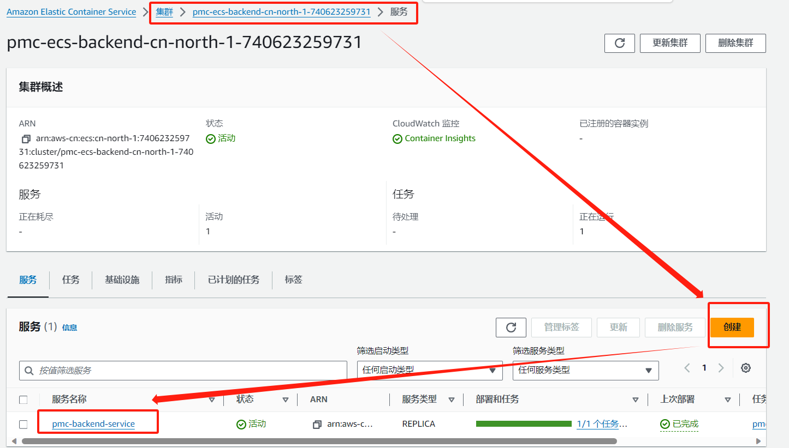

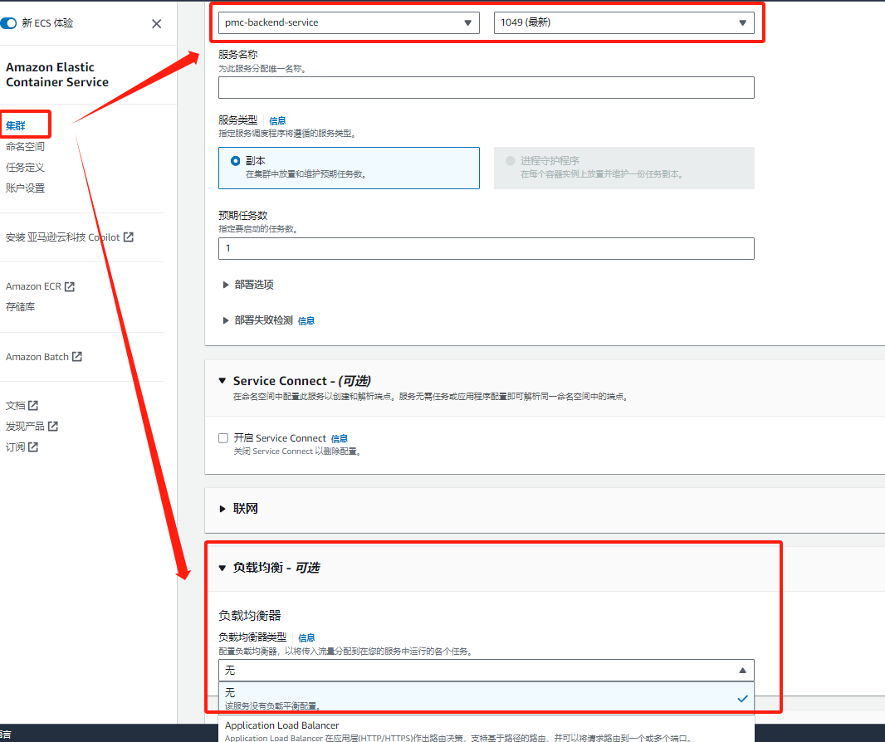

**总结**:
至此，链路清晰：

1. 用户访问公网域名，通过Route53解析并负载至CloudFront
2. CloudFront通过配置路由和LB服务器地址，路由至EC2的负载均衡器服务器
3. 负载均衡器注册目标组，监听相同端口号，转发至VPC内服务 （硬件参数）
4. 流量通过LB负载至ECS某一服务关联的集群，同时集群内设置的任务创建了容器，流量最终导入容器内

        CI/CD流程中，dockerfile指定映像URI，更新至具体某一容器
**本质是通过LB与服务关联，每新增一个服务，需配置一套LB规则**
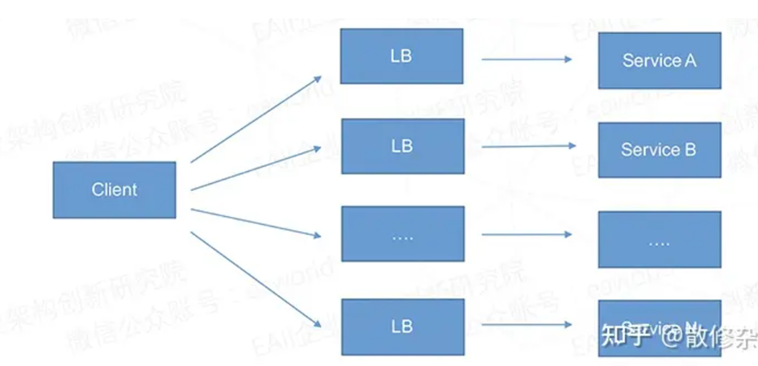

### 4.6 API Gateway

    API Gateway负责处理接受和处理成千上万个并发 API 调用过程中的所有任务:
    包括流量管理、CORS 支持、授权和访问控制、限流、监控以及 API 版本管理
**通过路由和后端资源关联**
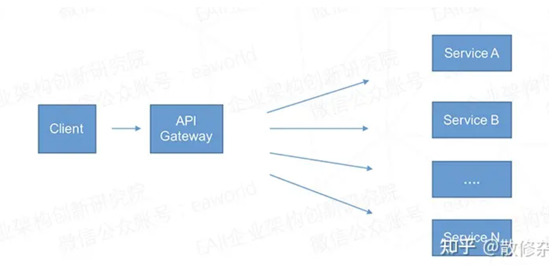

**集成：** 将路由连接到后端资源
**私有集成：** 能够与 VPC 中的私有资源（如 Application Load Balancer 或基于 Amazon ECS 容器的应用程序）创建 API 集成
**VPC 链接：** 允许 API 网关访问 Amazon VPC 中的私有资源（封装 API Gateway 与目标 VPC 资源之间的连接）

集成绑定了VPC链接，VPC链接定向的 VPC 的 Network Load Balancer（pmc-KoneView-nlb）

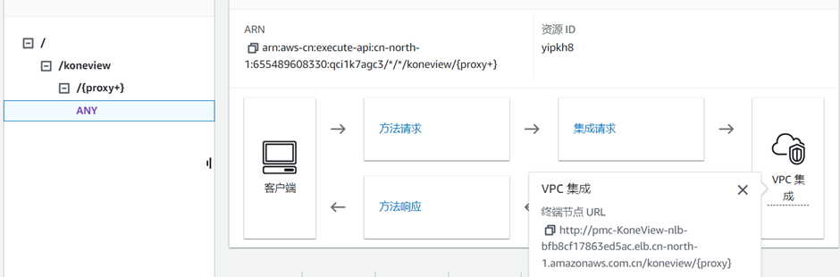

## 5. 微服务解决方案
| 功能       | Alibaba  | SpringCloud             | 其他                |
|----------|----------|-------------------------|-------------------|
| 服务注册服务发现 | Nacos    | SpringCloudEureka       | zookeeper、etcd    |
| API网关    | -        | SpringCloudGateway      | SpringCloudZuul   |
| 配置中心     | Nacos    | SpringCloudConfig       | Apollo            |
| 安全认证     | -        | SpringCloudSecurity     |                   |
| 熔断限流     | Sentinel | SpringCloudHystris      |                   |
| 服务调用     | Dubbo    | SpringCloudFeign        | OpenFeign         |
| 负载均衡     | -        | SpringCloudLoadBalancer | SpringCloudRibbon |
| 消息       | RocketMQ | RabbitMQ                | Kafka             |

## 6. A/B Test方案调研
